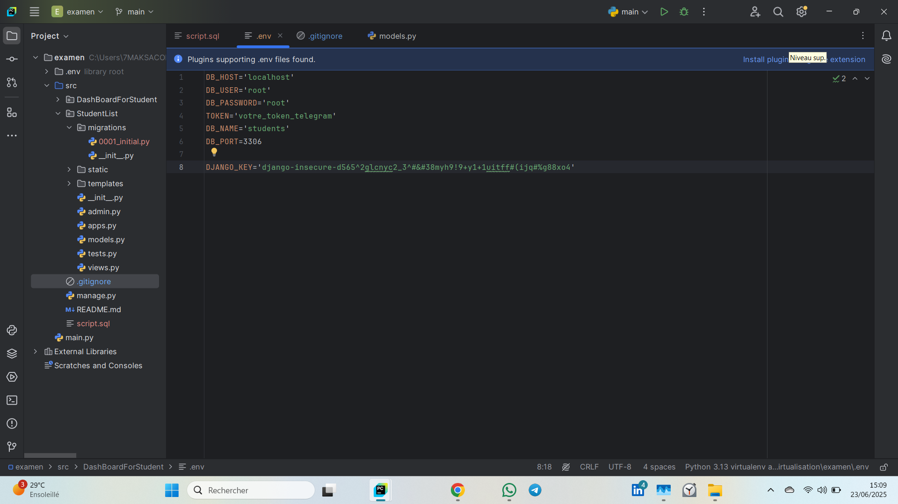

# examen_containeur

# Etapes pour mettre en place le tableau de bord:

## 1. Installer les packages necessaires
```
pip install -r requirements.txt
```

## 2. Appliquer les migrations
```
python manage.py makemigrations
```

## puis 
```
python manage.py migrate
```

## 3. Vous aurez besoin de mysql server deja installé. Si cela est deja fait, executer le fichier script.sql

## 4. Lancer le serveur django
```
python manage.py runserver
```


### NB: Un fichier .env a ete utilisé afin de masquer les variables d'environnement. Créez donc un fichier du même nom ```.env``` qui aura un tel contenu


### La clé ```DJANGO_KEY``` est dans le fichier settings.py dans ```SECRET_KEY```